

  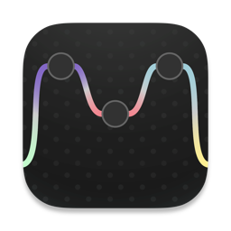

<h1 align="center">Mosaic</h1>

  <b>Your team's real apps, on one shared table.</b> 
  A multiplayer canvas made of live apps. Files move between computers without ever being sent. 
  Peer to peer. No servers. No accounts.

  <a href="https://github.com/canikatik-rgb/mosaic-updater/releases/latest"><b>Download</b></a> ·
  <a href="https://www.mosaicanvas.com">Website</a> ·
  <a href="https://www.mosaicanvas.com/privacy">Privacy</a>

  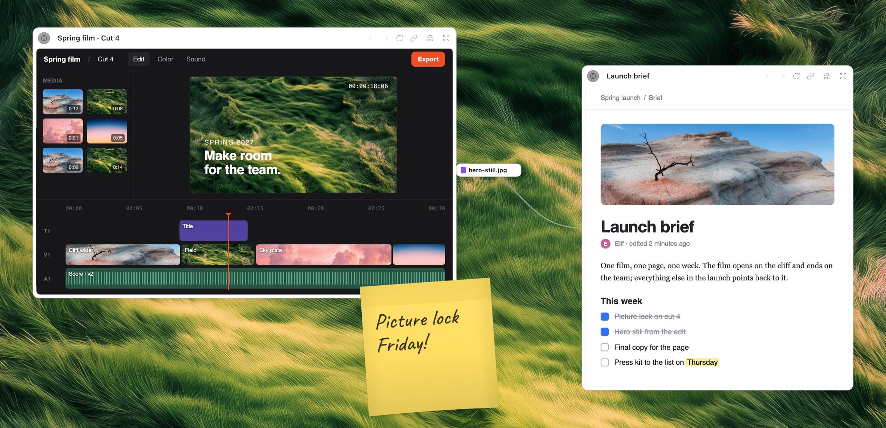

## What is Mosaic?

Mosaic is a desktop app for macOS, Windows and Linux. It's an infinite board where everyone brings the web apps they already work in, as live nodes. A page runs on its owner's computer, signed in as them, and everyone at the table watches it live.

Connect two nodes with a line and files start to travel along it: export something in one app, and it's already waiting in the next one, on someone else's computer. No attachment, no link, no upload.

Boards live only on the computers of the people on them. There is no Mosaic server holding your work, and no account to create.

## Download

Get the latest version from **[Releases](https://github.com/canikatik-rgb/mosaic-updater/releases/latest)**.

| Platform | File |
|---|---|
| macOS, Apple silicon | `Mosaic-<version>-arm64.dmg` |
| macOS, Intel | `Mosaic-<version>-x64.dmg` |
| Windows 10 and 11 | the `.exe` installer |
| Linux | the `.AppImage` |

Mosaic Bridge, the optional Chrome extension that lets pages open in your own Chrome with your extensions and logins, will come from the Chrome Web Store.

The first public release is on its way. Watch this repository (Watch › Custom › Releases) to hear when it's out.

## Highlights

<table>
  <tr>
    <td width="50%">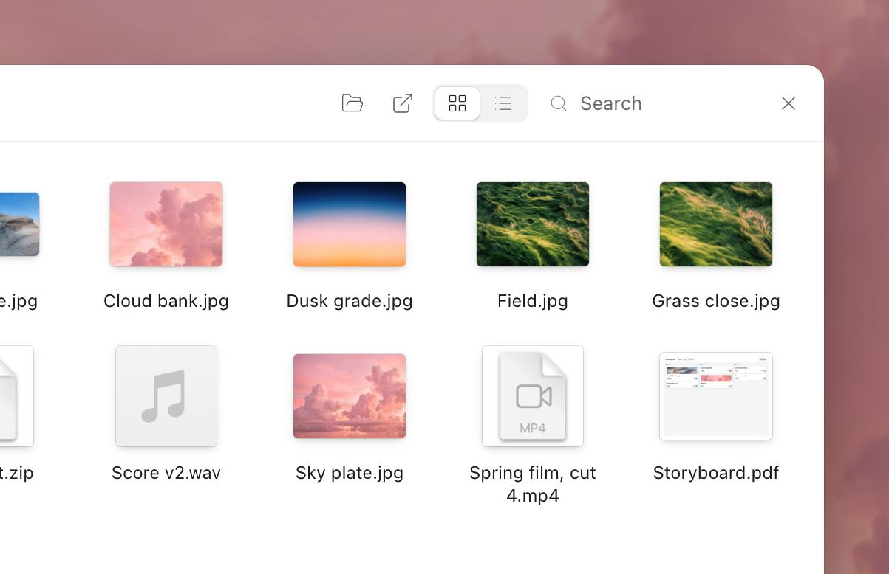</td>
    <td width="50%">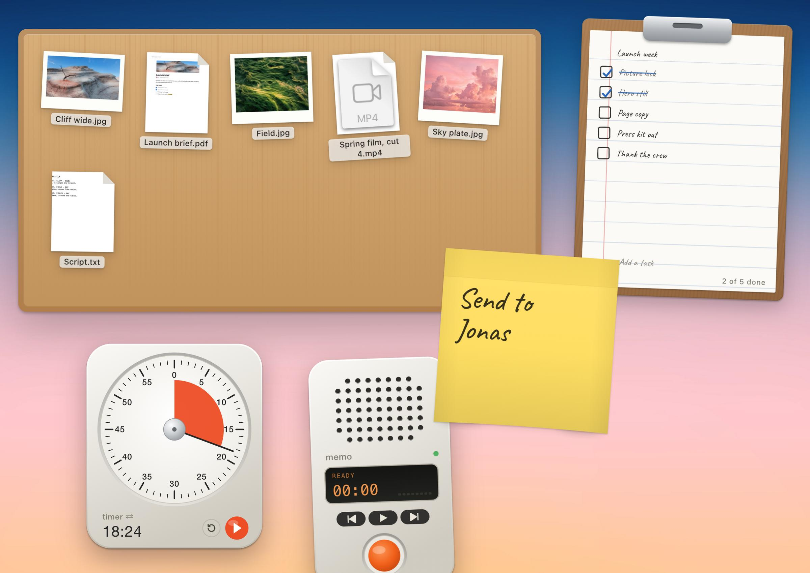</td>
  </tr>
  <tr>
    <td><b>A real folder, on the board.</b> Put a folder from your computer on the board. Anyone can open it in its own window and take what they need. Files only travel when someone opens or saves them, and nobody can write into yours.</td>
    <td><b>The desk.</b> Post-its, a timer, a voice memo recorder, a record player, a task list, a teleport… Desk objects made like the real thing, and everyone at the table can use them.</td>
  </tr>
</table>

- **Live apps as nodes.** Paste a link and it opens on the board: in Mosaic, or in your own Chrome through Mosaic Bridge. Focus mode gives a page the whole screen.
- **Files, bridged between computers.** Cards travel along connections between nodes, straight from one computer to the next, resuming where they left off and checked byte for byte when they land.
- **Everything you'd do at a real table.** Invite links and a knock to come in, roles (owner, partner, member, observer), live cursors, follow mode, "Look here", spatial audio, chat, and session history.
- **Private pages.** Mark a page private and it never leaves your screen; others see that it's there, not what's in it.
- **Works on your network.** In the same office, Mosaic finds the others on the local network and keeps working without internet.
- **Bring your own AI.** Invite an agent (Claude, OpenAI or Gemini, with your own API key) to read the board, write post-its, open pages and arrange nodes. Optional MCP tools, each asked for before use.

  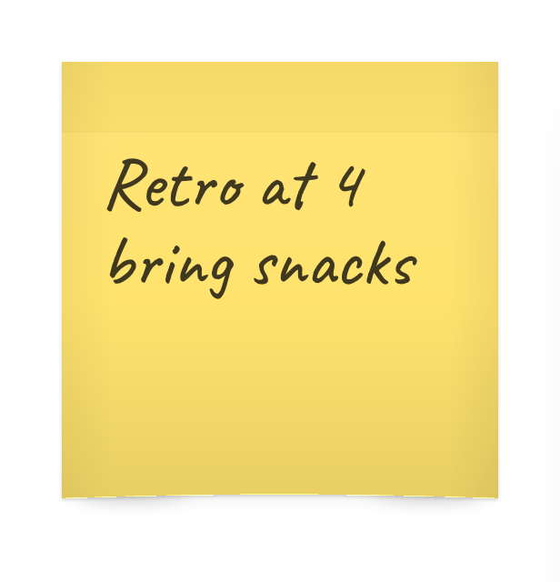
  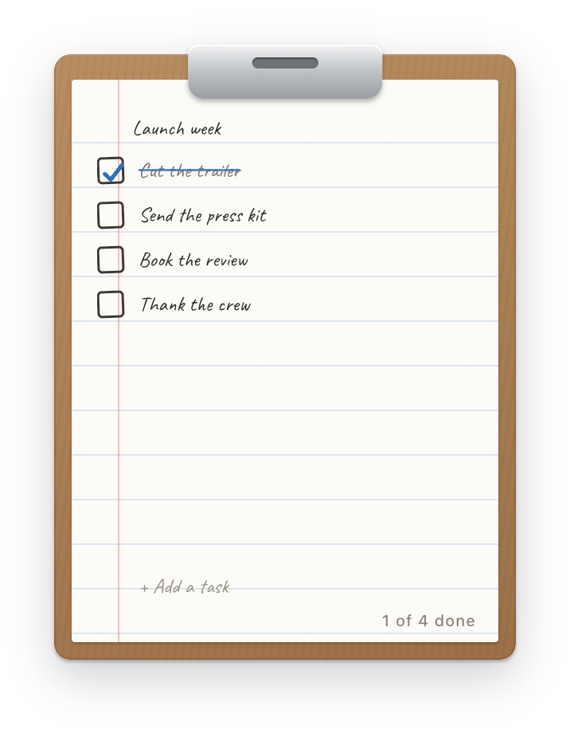
  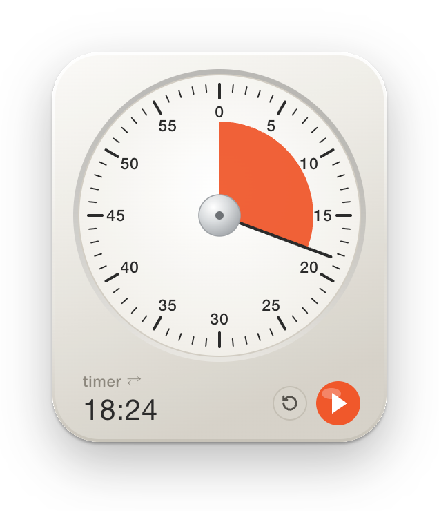
  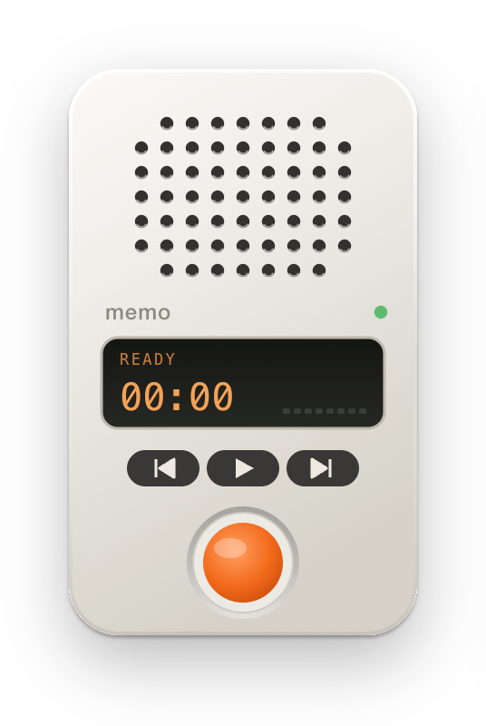
  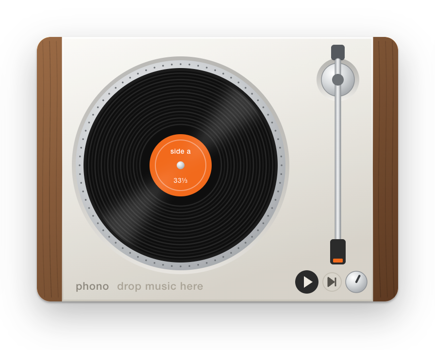
  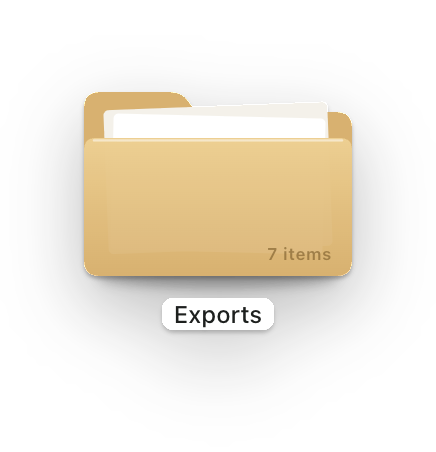
  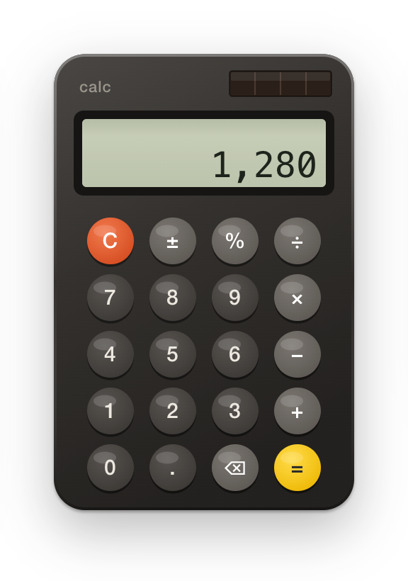
  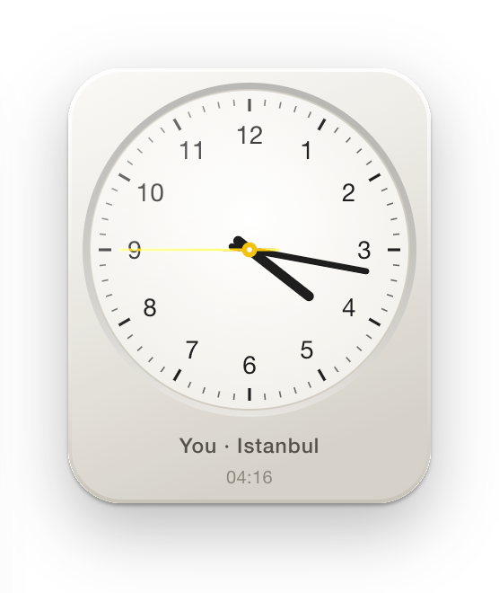

## How it works

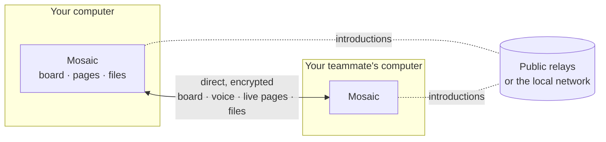

- **Local first.** A board is a CRDT document kept on the computer of everyone on it and synced between them; there is no copy anywhere else.
- **Peer to peer.** Computers connect directly over WebRTC, encrypted with the board's own key. Public relays (or the local network) only introduce them to each other; they never see the work.
- **Pages stay with their owner.** A web node runs on its owner's machine. Others receive a live picture of it, never its cookies, passwords or session.
- **Built with** Electron, React, TypeScript and Yjs.

## Pricing

**Free** for boards of up to 3 people. **Mosaic Team** is one payment for boards of up to 15 people, with AI agents and a year of updates. Privacy and files are never paid features. Details on [the website](https://www.mosaicanvas.com/#pricing).

## Privacy

No accounts, no analytics, no ads, and no servers holding your boards. What little data exists and where it goes is written down in the [privacy policy](https://www.mosaicanvas.com/privacy).

## Feedback

Found a bug or have an idea? [Open an issue](https://github.com/canikatik-rgb/mosaic-updater/issues).

## License

Mosaic is proprietary software; this repository hosts its release builds. Using it means agreeing to the [terms of use](https://www.mosaicanvas.com/terms).

© 2026 Caner Atik

